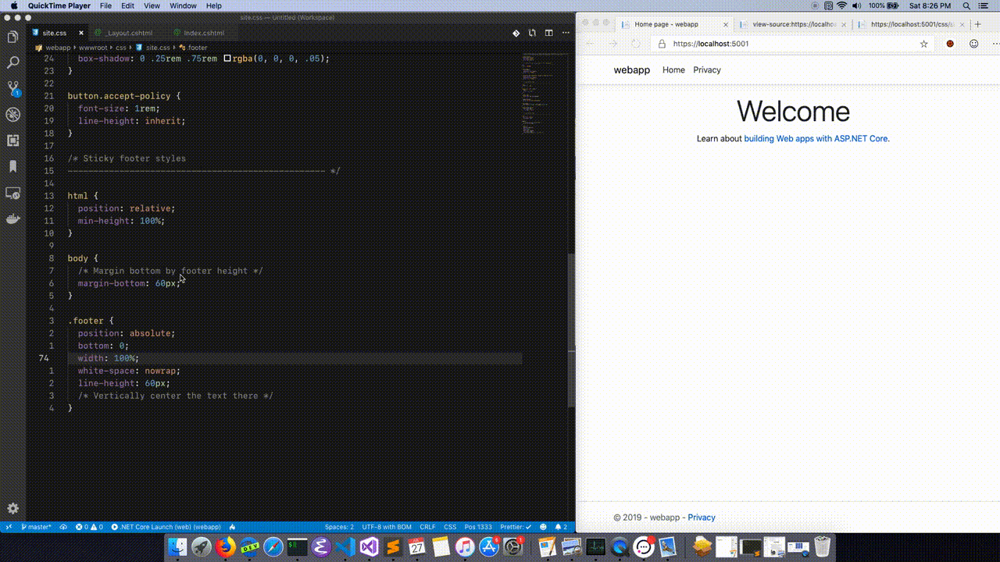

# DevReload

[](https://www.nuget.org/packages/Abiosoft.DotNet.DevReload)

Live reload for ASP.NET core development.

## Install

```sh
dotnet add package Abiosoft.DotNet.DevReload --version 0.1.4
```

## Usage

Use the middleware. Usually in `Startup.cs`

```csharp
using Abiosoft.DotNet.DevReload;

...
public void Configure(IApplicationBuilder app, IWebHostEnvironment env)
{
    if (env.IsDevelopment())
    {
        app.UseDevReload();
    }
...
}
```

Then, add the tag helper to your main layout file.

```cshtml
@addTagHelper *, Microsoft.AspNetCore.Mvc.TagHelpers
@addTagHelper *, Abiosoft.DotNet.DevReload

...

<environment include="Development">
    <devreload></devreload>
</environment>
```

And that's all. Just use `dotnet watch run` and your browser will auto reload.

## How

DevReload monitors the ASP.NET app by long polling a REST endpoint and monitor static files with FileSystemWatcher.

## Configure

You can modify the directories and file extensions for static files only.

```csharp
app.UseDevReload(new DevReloadOptions
{
    Directory = "./wwwroot",
    IgnoredSubDirectories = new string[] { ".git", ".node_modules" },
    StaticFileExtensions = new string[] { "css", "js", "html" },
});
```

## Demonstration


